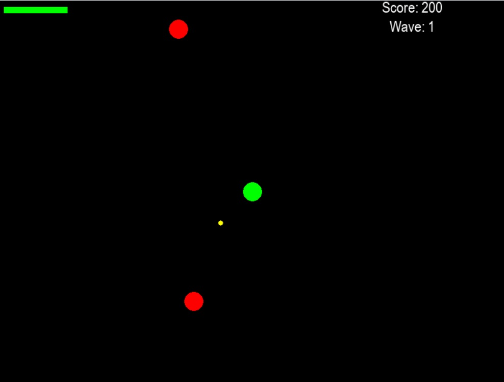

<h1 align="center">🎮 Arcade Survival</h1>

<p align="center">
  
</p>

---

## 📖 About the Game

**Arcade Survival** is a top-down 2D survival shooter built with Python and Pygame. The player must survive waves of enemies by moving, dodging, and shooting in a dynamically scaling environment. The game features a retro-inspired interface, resolution switching, basic audio controls, and a responsive UI system.

---

## 📂 Project Structure

```

arcade\_survival/
├── main.py
├── config/
│   ├── **init**.py
│   ├── settings.py
│   └── paths.py
├── core/
│   ├── **init**.py
│   ├── game.py
│   ├── menus.py
│   └── utils.py
├── entities/
│   ├── **init**.py
│   ├── player.py
│   ├── bullet.py
│   └── enemy.py
├── assets/
│   ├── images/
│   │   ├── player.png
│   │   ├── enemy.png
│   │   └── background.jpg
│   ├── sounds/
│   │   ├── shoot.mp3
│   │   ├── kill.mp3
│   │   ├── gameover.mp3
│   │   └── music.mp3
│   └── fonts/
│       └── arial.ttf
├── data/
│   ├── highscores.json
│   └── settings.json
├── requirements.txt
├── README.md
└── .gitignore

````

---

## ✅ Features Implemented

- ✅ Modular and scalable project structure
- ✅ Functional main menu, pause menu, and options menu
- ✅ Player movement (WASD) and mouse-aimed shooting
- ✅ Bullet collision with enemies
- ✅ Enemy wave generation with difficulty scaling
- ✅ Health bar and player damage system
- ✅ Sound effects: shoot, kill, game over (using safe loader)
- ✅ Background music with volume control
- ✅ Resolution switching and fullscreen toggle
- ✅ JSON support for future persistent data
- ✅ Graceful error handling for missing or failed audio assets

---

## 🛠️ To Do / Work in Progress

- ☐ Add individual volume control for `general_volume`, `music_volume` and `effects_volume`
- ☐ Save and load player score from `highscores.json`
- ☐ Animated sprites for characters
- ☐ Add new enemy types with behaviors
- ☐ Implement power-ups (speed, double-shot, etc.)
- ☐ Game over and retry screen
- ☐ Difficulty selection (easy, normal, hard)
- ☐ Gamepad/controller support
- ☐ In-game settings with UI sliders
- ☐ Local leaderboard system

---

## 🧩 Requirements

- Python 3.12+
- Pygame 2.6+

To install dependencies:

```bash
pip install -r requirements.txt
````

---

## 🚀 Running the Game

```bash
python main.py
```

---

## 🧠 Credits

* Developed using **Pygame** and **Python 3**
* All visual and sound assets used here are placeholders — replace them before redistribution

---

## 📃 License

This project is licensed under the **MIT License** (see `LICENSE`).
**Note:** Assets in the `assets/` folder are for educational use only and should be replaced for commercial or production use.